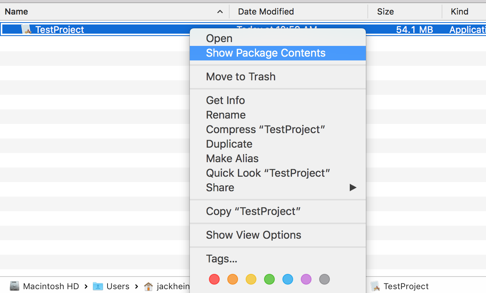
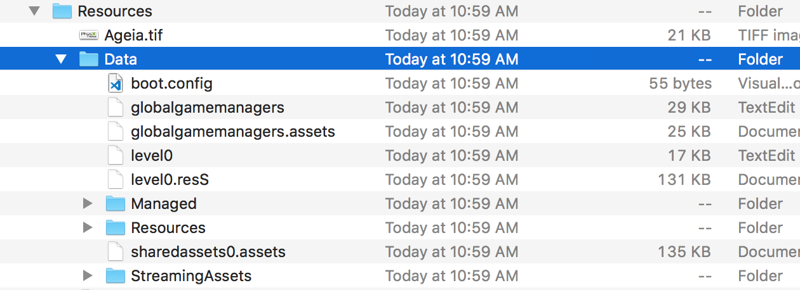
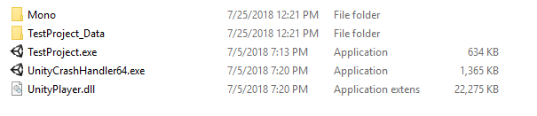
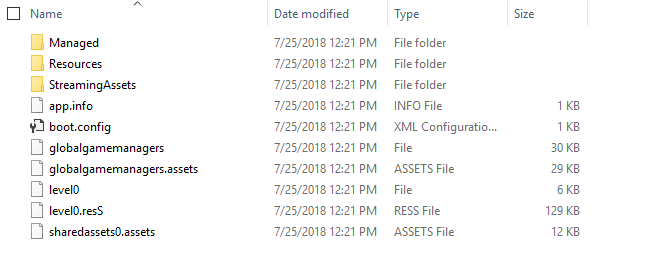

# Guide to Translating Data
## Guide for Mac
1) Right click the .app file (your Unity project) and select "Show package contents" to view the associated files. 

2) Locate the JSON file under Resources/Data/StreamingAssets

3) Run the "JSONFormatterMac" script to reformat the JSON file for readability. This script will be found under the Scripts folder. 
4) Open the JSON file and replace any text with new, translated text to be used in the project.
5) Save the JSON file and run the project.

## Guide for Windows
1) Navigate to the data folder associated with the executable file for the project (Seen here as TestProject_Data).

2) Navigate to the JSON file under the StreamingAssets folder.

3) Run the "JSONFormatterWin" script to reformat the JSON file for readability. This script will be found under the Scripts folder.
4) Open the JSON file and replace any text with new, translated text to be used in the project.
5) Save the JSON file and run the project.
